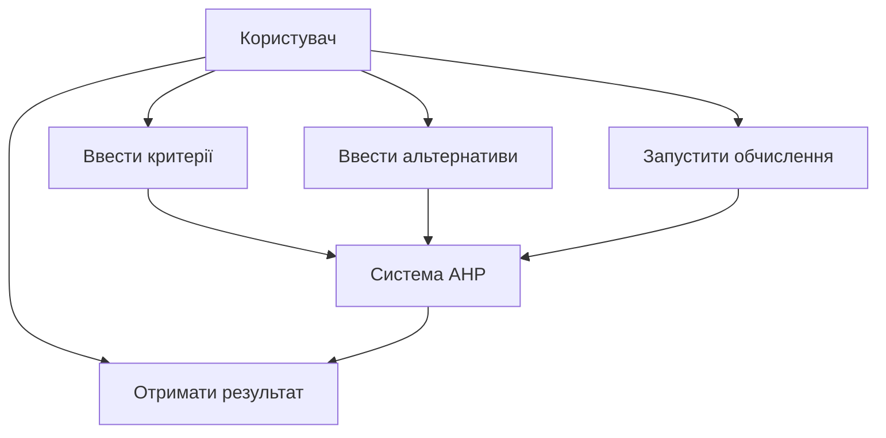
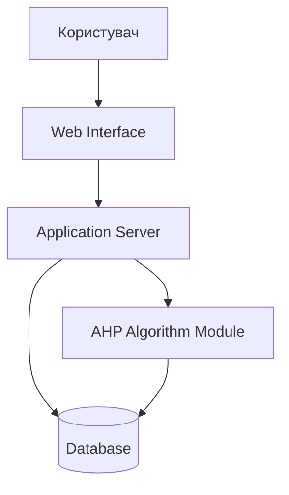
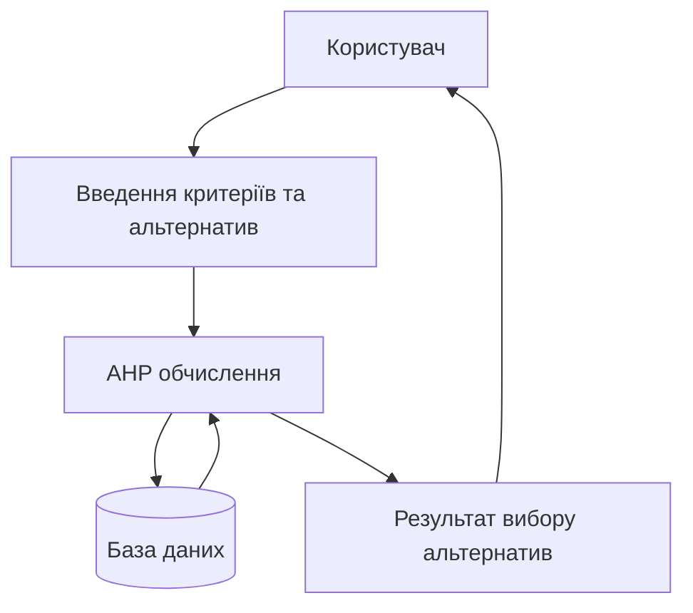

# Лабораторна робота №6  
## Побудова діаграм

## Тема бакалаврської роботи

Розробка веб-застосунку підтримки прийняття рішень на основі методу аналізу ієрархій (AHP).

## Основні deliverables

Результатом бакалаврської роботи є:

- веб-застосунок для вибору альтернатив
- реалізація алгоритму методу аналізу ієрархій
- інтерфейс користувача
- програмний код системи
- документація системи
- діаграми архітектури та процесів

---

# 1. Альтернативи діаграм

Було обрано три категорії діаграм:

- структурні діаграми
- діаграми бізнес-процесів
- діаграми поведінки

---

# 1.1 Структурні діаграми

## Component Diagram (UML)

Опис  
Component diagram використовується для відображення архітектури системи та взаємодії між компонентами.

Переваги

- показує архітектуру системи
- зрозуміла для розробників

Недоліки

- не відображає логіку роботи системи

---

## Class Diagram (UML)

Опис  
Class diagram показує класи системи, їх властивості та зв’язки між ними.

Переваги

- добре підходить для об’єктно-орієнтованих систем

Недоліки

- складна для великих систем

---

## Deployment Diagram (UML)

Опис  
Deployment diagram показує фізичне розміщення компонентів системи на серверах або пристроях.

Переваги

- демонструє інфраструктуру системи
- допомагає зрозуміти розгортання системи

Недоліки

- не відображає логіку роботи програми

---

# 1.2 Діаграми бізнес-процесів

## BPMN

Опис  
BPMN використовується для моделювання бізнес-процесів організації.

Переваги

- міжнародний стандарт
- добре підходить для опису процесів

Недоліки

- складна нотація

---

## DFD

Опис  
DFD (Data Flow Diagram) використовується для відображення потоків даних у системі.

Переваги

- проста для розуміння
- показує рух інформації

Недоліки

- не показує структуру системи

---

## EPC

Опис  
EPC (Event-driven Process Chain) використовується для моделювання бізнес-процесів та подій, які запускають певні дії.

Переваги

- добре показує логіку процесів
- зрозуміла структура подій і функцій

Недоліки

- використовується рідше ніж BPMN

---

# 1.3 Діаграми поведінки

## Use Case Diagram (UML)

Опис  
Use Case diagram показує взаємодію користувача із системою.

Переваги

- проста для розуміння
- добре описує функції системи

Недоліки

- не показує детальну логіку

---

## Activity Diagram (UML)

Опис  
Activity diagram показує послідовність виконання дій у системі.

Переваги

- зрозуміла структура процесу

Недоліки

- не відображає архітектуру системи

---

## Sequence Diagram (UML)

Опис  
Sequence diagram показує взаємодію між об'єктами системи у часі.

Переваги

- демонструє порядок виконання операцій
- добре підходить для опису сценаріїв роботи

Недоліки

- може бути складною при великій кількості об'єктів

---

# 2. Реалізація діаграми

## Діаграма Use Case

---

# 3. Друга діаграма

## Component Diagram (UML)

### Чому обрано

Component diagram була обрана тому, що вона дозволяє показати архітектуру системи та взаємодію між основними компонентами веб-застосунку AHP.

Діаграма допомагає зрозуміти, з яких частин складається система та як вони взаємодіють між собою.

---

## Діаграма компонентів системи

---

# 4. Третя діаграма

## Data Flow Diagram (DFD)

### Чому обрано

DFD була обрана тому, що вона дозволяє показати рух даних у системі підтримки прийняття рішень.  
Ця діаграма демонструє, як дані передаються від користувача до системи, обробляються алгоритмом AHP та зберігаються у базі даних.

DFD допомагає зрозуміти логіку обробки інформації та потоки даних між основними компонентами системи.

---

## Діаграма потоків даних

---

# Список використаних джерел

1. UML Diagrams. URL: https://www.uml-diagrams.org  
2. BPMN Specification. URL: https://www.omg.org/bpmn  
3. Mermaid Documentation. URL: https://mermaid.js.org
